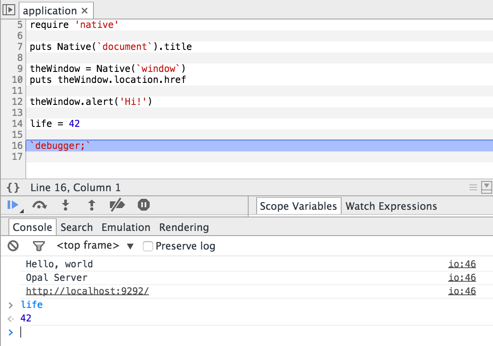

# Is That a Ruby In Your Browsers?

*An Introduction To Opal*


<div class="notes">
- Welcome
- Introduce yourself
</div>

# PSA for Examples

*Ruby code is compiled and run live, and the JavaScript is verbose!*

<br/>

. . .

As such, they are best viewed **in a browser**

<br/>

. . .

So if you are reading a static slide, go here:

[bspaulding.github.io/ruby-in-your-browsers](http://bspaulding.github.io/ruby-in-your-browsers "bspaulding.github.io/ruby-in-your-browsers")

# What Is Opal?

. . .

Ruby to JavaScript Transpiler

. . .

*AKA a "source to source" compiler*

. . .

<div class="editor">
```ruby
puts "Hello, World"
```
```output
```
```javascript
```
</div>

# What Is Opal?

JavaScript bridge

*Browser APIs, NodeJS Support*

. . .

<div class="editor">
```ruby
puts %x{document.title}
%x{
  console.log(#{ RUBY_ENGINE_VERSION })
}
```
```output
```
```javascript
```
</div>

# What Is Opal?

JavaScript bridge

<div class="editor">
```ruby
require 'native'
win = Native(`window`)
puts win.location.href
# win.alert('+1 for native bridging!')
```
```output
```
```javascript
```
</div>

# What Is Opal?


. . .

> *"a gemstone consisting of hydrated silica, typically **semitransparent** and showing varying colors against a pale or dark background"*

> New Oxford American Dictionary

# What Is Opal?


National Gemstone of Australia

[Wikipedia](http://en.wikipedia.org/wiki/Opal)

----------


# Example: Fibonacci

<div class="editor vsplit">
```ruby
def fib(n)
  n <= 1 ? 1 : fib(n - 1) + fib(n - 2)
end

puts (1..10).
  map {|n| fib n }.
  map(&:to_s).
  join(", ")
```
```javascript
```
```output
```
</div>

<div class="notes">
This example shows off several ruby features:
<ul>
<li>implicit returns
<li>ranges
<li>enumeration with blocks
<li>symbol to_proc
</div>

# Example: Hamming Distance

<div class="editor vsplit">
```ruby
def hamming(a,b)
	a.split("").
    zip(b.split("")).
    select {|(a,b)| a != b }.
    length
end

puts hamming("rubyist", "opalist")
puts hamming("happy", "yappy")
puts hamming("goose", "geese")
```
```javascript
```
```output
```
</div>

<div class="notes">
Ruby features:
<ul>
<li>Collection helpers: split, zip, select/filter
<li>anonymous blocks
<li>feaux pattern matching for block arg
</ul>
</div>

# Example: Classes

<div class="editor vsplit">
<pre class="ruby">
<code contenteditable>class Greeter
  def initialize(name = "Opal")
    @name = name
  end

  def say_hello
    puts greeting
  end

  def greeting
    "Hello, #{@name}!"
  end
end

class LoudGreeter < Greeter
  def greeting
    super.upcase
  end
end

greeter = Greeter.new
greeter.say_hello
</code></pre>

<pre class="javascript"><code></code></pre>

<pre class="output"><code></code></pre>
</div>

# Example: Modules

<div class="editor vsplit">
```ruby
class Array
  def all?
    each {|n| return false unless n }
  end
end

module Validatable
  def self.included(base)
    base.extend(ClassMethods)
  end

  def valid?
    self.class.validations.
      map {|attribute, block|
        block.call(self.send(attribute))
      }.all?
  end

  module ClassMethods
    def validate(attribute, &block)
      validations[attribute] = block
    end

    def validations
      @validations ||= {}
    end
  end
end

class Person
  include Validatable

  attr_accessor :name

  validate(:name) {|value|
    !value.to_s.empty?
  }
end

brad = Person.new
puts brad.valid?
brad.name = "Bradley"
puts brad.valid?
```
```javascript
```
```output
```
</div>

# How Ruby is it?

## RubySpec

<table style="width: 80%; margin: 20px auto;">
  <thead>
		<tr>
			<th>Version</th>
			<th>Date</th>
			<th>Examples</th>
		</tr>
	</thead>
	<tbody>
		<tr>
			<td>0.5.5</td>
			<td>2013-11</td>
			<td>2,715*</td>
		</tr><tr>
			<td>0.6.3</td>
			<td>2014-11</td>
			<td>3,070</td>
		</tr><tr>
			<td>0.7.0.beta1</td>
			<td>2014-10</td>
			<td>3,445</td>
		</tr><tr>
			<td>0.7.0.beta2</td>
			<td>2014-11</td>
			<td>3,601</td>
		</tr><tr>
			<td>0.7.0.beta3</td>
			<td>2014-11</td>
			<td>3,603</td>
		</tr><tr>
	</tbody>
</table>

\* not all passing (for me!)

*For context, ~20k rubyspecs total*

# How Ruby is it?

## Missing A Few Things:

- Mutable Strings / Symbols
	- no ```#<<``` or ```#gsub!```
- Encodings
- Threads
- Frozen Objects
- method_added/method_removed
	- *considered a bug, will be fixed*
- private/protected
- C Extensions
- File/Network IO
	- _coming in 0.7 for Node.js_
- ~~method_missing~~

# Debugging



# Testing

RSpec via opal-rspec

. . .

<br/>
Adds async support:

```ruby
async 'HTTP requests should work' do
  HTTP.get('/users/1.json') do |res|
    run_async {
      expect(res).to be_ok
    }
  end
end
```

# Notable Libraries

## opal-browser

Browser API wrapper:

DOM, CSS, AJAX, WebSockets, SSE, History, Storage, SQL

```ruby
$document.ready do
  DOM {
    div.info {
      span.red "I'm all cooked up."
    }
  }.append_to($document.body)
end
```

# Notable Libraries

## opal-jquery

"toll-free" bridge to JQuery

```ruby
foos = Element.find('.foo')
# => [<div class="foo">, ...]

foos.class
# => JQuery

foos.on(:click) do
  alert "element was clicked"
end
```

# Notable Libraries

## Templating

support for erb and haml

```ruby
require 'template'

template = Template['user']
context  = User.new('Ford Prefect')

puts template.render(context)
# => "<div>...</div>"

Template.paths
# => [#<Template: 'views/user'>, #<Template: 'login'>]
```

# Notable Libraries

## Promise

```ruby
require 'promise'
first = get_json '/users/1.json'
second = get_json '/users/2.json'

Promise.when(first, second).then do |user1, user2|
  puts "got users: #{user1}, #{user2}"
end.fail do
  alert "Something bad happened"
end
```

# Frameworks

- [Vienna](https://github.com/opal/vienna)
	- client side
	- MVC
- [Lissio](https://github.com/meh/lissio)
	- client side
	- Component centric
- [Volt](https://github.com/voltrb/volt)
	- full stack, similar to meteor
	- hybrid mvc / component structure
	- reactive view bindings
	- persistence
	- messaging

# Resources

- Project Home
	- [opalrb.org](http://opalrb.org)
	- [github.com/opal](http://opalrb.org/try/)
- Presentations
	- [Opal: A New Hope](http://www.confreaks.com/videos/2904-rubyconf2013-opal-a-new-hope-for-ruby-programmers)
- Examples
	- [opalrb.org/try](http://opalrb.org/try/)
	- [opal-todos](https://github.com/opal/opal-todos)

<div class="notes">
Opal: A New Hope; Old, talks a lot about possibly defunct, smalltalk inspired opal-inspector project
</div>

# Thanks!


github/*bspaulding*

twitter/*bradspaulding*


